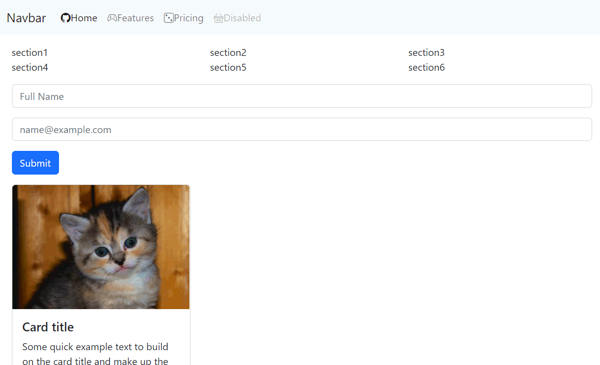

Web Layout Frameworks
=====================
AKA: CSS Frameworks

Objectives
1. Understand some of the core functionality of `css`
    * Id's, class's, selector combinations, transitions, dynamic manipulation of class's
2. Understand the deficiencies of raw css
3. Understand the problems css frameworks are trying to solve
4. Use a range of web frameworks to create a responsive page
5. Understand that a range of frameworks exist


HTML Styles
-----------

Old horrible example
```html
<!doctype html>
<html>
<head>
    <meta charset="UTF-8" />
    <title>html test</title>
</head>
<body>
    <h1 style="color: red; font-size: 10em;">My Heading</h1>
    <ul>
        <li style="list-style-type: square;">Thing</li>
        <li style="list-style-type: square;">Thing again</li>
        <li style="list-style-type: square;">Thing more</li>
    </ul>
</body>
</html>
```
Does not scale - as project grows, difficult to maintain consistency

CSS
---

Refresher and some advanced features

### CSS Style tags

```html
<!doctype html>
<html>
<head>
    <meta charset="UTF-8" />
    <title>html test</title>
    <style>
        h1 {
            color: red;
            font-size: 3em;
        }

        ul li {
            list-style-type: square;
        }
    </style>
</head>
<body>
    <h1>My Heading</h1>
    <ul>
        <li>Thing</li>
        <li>Thing again</li>
        <li>Thing more</li>
    </ul>
    <ul>
        <li>Another list</li>
        <li>Another list2</li>
    </ul>
</body>
</html>
```

### Style ID's and Class's

* ID - prefixed  with `#`
    * Only one
    * I tend to only use ID's when their is javascript interaction or associated code/behaviour
* class - prefixed with `.`
    * Can be applied many times
* css selectors can be joined with 
    * ` ` (space) And child in tree
    * `>` immediate child 
    * more...

```html
<!doctype html>
<html>
<head>
    <meta charset="UTF-8" />
    <title>html test</title>
    <style>
        h1 {
            color: red;
            font-size: 3em;
        }

        ul li {
            list-style-type: square;
        }

        #my_list li {
            display: inline-block;
            border-radius: 1em;
            background-color: lightgray;
            padding: 1em;
            margin: 1em;
        }

        .highlight {
            color: greenyellow;
        }
    </style>
</head>
<body>
    <h1>My Heading</h1>
    <ul id="my_list">
        <li>Thing</li>
        <li>Thing again</li>
        <li class="highlight">Thing more</li>
    </ul>
    <ul>
        <li class="highlight">Another list</li>
        <li>Another list2</li>
    </ul>
</body>
</html>
```

Advanced CSS
------------

### Transitions with animation

Add the following to the above example
```css
        #my_list li {
            /* ... */
            transition: background-color 1000ms linear;
        }
        #my_list li:hover {
            background-color: red;
        }
```

### Style Class's on parent

1. Add this css
    * ```css
        .big #my_list li {
            padding: 2em;
            font-size: larger;
        }
        ```
2. Manually in dev-tools add the class `big` to `body`
    * see it work
3. Add some javascript to toggle the class
```html
<button id="big_button">Make Big</button>

<script type="module">
    const $body = document.getElementsByTagName("body")[0];
    const $element = document.getElementById("big_button");
    $element.addEventListener("click", event => {
        $body.classList.toggle("big");
    });
</script>
```

### Media Queries

Add the css below and resize the browser to less than 600px.
```css
@media only screen and (max-width: 600px) {
  body {
    background-color: lightblue;
  }
}
```

### TASK: Login Screen Transition (Challenge)

* [Challenge: Login Screen - CSS Transition](https://github.com/calaldees/TeachProgramming/tree/master/teachprogramming/static/projects/web/login)


Problems with CSS
-----------------

* Problems
    * It quickly becomes unmanageable
        * elements that inherit form multiple styles create changes all over the site
        * All styles are intertwined somehow
        * Lots and lots of class names that are not named consistently
    * Difficult to make sites look consistent
    * Lost of css required to support responsive design with multiple media query sizes
* Solutions
    * [Sass: Syntactically Awesome Style Sheets](https://sass-lang.com/) - CSS with superpowers 
        * preprocessor scripting language for css
            * Variables, functions, mixins
        * You write in something similar to CSS with cool new features and it generate css files
            * If css your css was complicated before - with sass you've now made it even more complicated
            * Can generate an ungodly amount of plain css as output if used unchecked
        * [Sass in 100 Seconds](https://www.youtube.com/watch?v=akDIJa0AP5c) video
    * CSS Frameworks
        * People that have made MANY beautiful websites have structured their knowledge into refined tools we can use
        * Beware - once you use it, you're locked in! - escape is difficult


12 part grid system
-------------------

* Why not use base 10!
    * Divide by two! yeah! now again .. oh .. 
    * Divide by three ... oh .. 
    * Divide by four ... oh .. 
* Why base 12 is amazing! You can divided it by
    * Two! yeah! and again .. YEAH!
    * Divide by 3, yeah!
    * Divide by 4, YEAH!
    * Divide by 6 yeah!
    * You can slice by quarter and 3rd without fractions


Bootstrap 5.2
-------------

* my old example (bootstrap 4.x)
    * https://barcampcanterbury.com/
    * use dev-tools with mobile simulation

* https://getbootstrap.com/
    * > Build fast, responsive sites with Bootstrap
    * > Quickly design and customize responsive mobile-first sites with Bootstrap, the world’s most popular front-end open source toolkit, featuring Sass variables and mixins, responsive grid system, extensive prebuilt components, and powerful JavaScript plugins. 
    * Responsive
        * Mobile simulation in devtools
        * Resize window
        * Breakpoints https://getbootstrap.com/docs/5.2/layout/breakpoints/
            * sm, md, lg
        * Grid
            * https://getbootstrap.com/docs/5.2/layout/grid/
            * 12 Column system (base 12 rocks!)
        * Utilities
            * Try not to write your own css where possible - use the framework tools
            * https://getbootstrap.com/docs/5.2/utilities/spacing/
            * https://getbootstrap.com/docs/5.2/utilities/borders/
        * Cards
            * https://getbootstrap.com/docs/5.2/components/card/
        * Navbar
            * https://getbootstrap.com/docs/5.2/components/navbar/
            * fixed top?
        * Spinners - for loading
            * https://getbootstrap.com/docs/5.2/components/spinners/
        * Forms
            * validation
            * https://getbootstrap.com/docs/5.2/forms/validation/
            * https://getbootstrap.com/docs/5.2/forms/floating-labels/
        * Toast
        * ScrollSpy
    * [Icons](https://icons.getbootstrap.com/)
        * Via CDN as a web-font
    * [theme's](https://themes.getbootstrap.com/)
    * [Examples](https://getbootstrap.com/docs/5.1/examples/)


### Bootstrap Icons Example
* [Icons](https://icons.getbootstrap.com/)
```html
<head>
    <link rel="stylesheet" href="https://cdn.jsdelivr.net/npm/bootstrap-icons@1.9.1/font/bootstrap-icons.css">
</head>

<body>
    <i class="bi-alarm"></i>
    <i class="bi-github" role="img" aria-label="GitHub"></i>
</body>
```

### Task
Create the following website layout in Bootstrap.

```
Navbar | Shopping basket + Game controller +  Dice

---

large breakpoint

| section1 | section2 | section3 |

| section4 | section5 | section6 |

medium breakpoint

| section1 | section2 | section3 |

| section4                       |
| section5                       |
| section6                       |

small breakpoint

| section1 |
| section2 |
| section3 |
| section4 |
| section5 |
| section6 |

---

Form input with floating text for email and password
A button

---

3 Cards with PlaceKitten images
https://placekitten.com/

```


Use the documentation https://getbootstrap.com/docs/5.2/getting-started/introduction/

Starting `index.html` boilerplate
```html
<!doctype html>
<html lang="en">
<head>
    <meta charset="utf-8">
    <meta name="viewport" content="width=device-width, initial-scale=1">
    <link href="https://cdn.jsdelivr.net/npm/bootstrap@5.2.2/dist/css/bootstrap.min.css" rel="stylesheet" integrity="sha384-Zenh87qX5JnK2Jl0vWa8Ck2rdkQ2Bzep5IDxbcnCeuOxjzrPF/et3URy9Bv1WTRi" crossorigin="anonymous">
    <script src="https://cdn.jsdelivr.net/npm/bootstrap@5.2.2/dist/js/bootstrap.bundle.min.js" integrity="sha384-OERcA2EqjJCMA+/3y+gxIOqMEjwtxJY7qPCqsdltbNJuaOe923+mo//f6V8Qbsw3" crossorigin="anonymous"></script>
    <link rel="stylesheet" href="https://cdn.jsdelivr.net/npm/bootstrap-icons@1.7.0/font/bootstrap-icons.css">
    <title>Bootstrap Demo</title>
</head>
<body>

    <nav class="navbar">
        Navbar | Shopping basket + Game controller +  Dice
    </nav>

    <div class="container my-3">
        6 Responsive Containers go here
    </div>

    <div class="container my-3">
        Form input with floating text for email and password
        A button
    </div>

    <div class="container my-3">
        3 Cards with PlaceKitten images
    </div>

</body>
</html>
```

<details>

```html
    <!-- https://getbootstrap.com/docs/5.2/components/navbar/#nav -->
    <!-- https://icons.getbootstrap.com/ -->
    <nav class="navbar navbar-expand-lg bg-light">
        <div class="container-fluid">
          <a class="navbar-brand" href="#">Navbar</a>
          <button class="navbar-toggler" type="button" data-bs-toggle="collapse" data-bs-target="#navbarNav" aria-controls="navbarNav" aria-expanded="false" aria-label="Toggle navigation">
            <span class="navbar-toggler-icon"></span>
          </button>
          <div class="collapse navbar-collapse" id="navbarNav">
            <ul class="navbar-nav">
              <li class="nav-item">
                <a class="nav-link active" aria-current="page" href="#"><i class="bi bi-github"></i>Home</a>
              </li>
              <li class="nav-item">
                <a class="nav-link" href="#"><i class="bi bi-controller"></i>Features</a>
              </li>
              <li class="nav-item">
                <a class="nav-link" href="#"><i class="bi bi-dice-3"></i>Pricing</a>
              </li>
              <li class="nav-item">
                <a class="nav-link disabled"><i class="bi bi-basket"></i>Disabled</a>
              </li>
            </ul>
          </div>
        </div>
      </nav>


    <div class="container my-3">

        <!-- https://getbootstrap.com/docs/5.2/layout/grid/#mix-and-match -->
        <div class="row">
            <div class="col-md-4">
            section1
            </div>
            <div class="col-md-4">
            section2
            </div>
            <div class="col-md-4">
            section3
            </div>
        </div>
        <div class="row">
            <div class="col-lg-4">
            section4
            </div>
            <div class="col-lg-4">
            section5
            </div>
            <div class="col-lg-4">
            section6
            </div>
        </div>

    </div>

    <div class="container my-3">
        <!-- https://getbootstrap.com/docs/5.2/forms/form-control/#example -->
        <div class="mb-3">
            <input type="text" class="form-control" placeholder="Full Name">
          </div>
          
        <div class="mb-3">
            <input type="email" class="form-control" id="exampleFormControlInput1" placeholder="name@example.com">
        </div>
        <!-- https://getbootstrap.com/docs/5.2/components/buttons/#examples -->
        <button type="button" class="btn btn-primary">Submit</button>
    </div>


    <div class="container my-3">
        <!-- https://getbootstrap.com/docs/5.2/components/card/#example -->
        <div class="card" style="width: 18rem;">
            
            <div class="card-body">
              <h5 class="card-title">Card title</h5>
              <p class="card-text">Some quick example text to build on the card title and make up the bulk of the card's content.</p>
              <a href="#" class="btn btn-primary">Go somewhere</a>
            </div>
          </div>
    </div>

```
</details>

Skeleton
--------

* http://getskeleton.com
    * > A dead simple, responsive boilerplate
    * > Light as a feather at ~400 lines & built with mobile in mind
    * > Styles designed to be a starting point, not a UI framework
    * > Quick to start with zero compiling or installing necessary

* Only one small breakpoint (to start with)
* [Example responsive landing page](http://getskeleton.com/examples/landing/) 

### TASK - Try Skeleton

With boilerplate below

```html
<html>
<head>
    <title>Skeleton Test</title>
    <link rel="stylesheet" href="https://cdnjs.cloudflare.com/ajax/libs/skeleton/2.0.4/skeleton.min.css">
</head>
<body>

<!-- bit of my css to help view grid -->
<style>.example-grid .column, .example-grid .columns {background-color: lightgray;}</style>
<div class="container example-grid">

    <!-- Copy and Paste examples from http://getskeleton.com -->

</div>

</body>
</html>
```

tailwindcss
-----------

* [tailwindcss](https://tailwindcss.com/)
    * > Rapidly build modern websites without ever leaving your HTML.
    * [Utility First](https://tailwindcss.com/docs/utility-first)

* My opinion
    * Great when used with a client framework with reusable components
    * Templates become very verbose and bloated - hard to read
    * [@apply](https://tailwindcss.com/docs/reusing-styles#extracting-classes-with-apply) could solve some of this, but requires css compilation framework

```html
<!doctype html>
<html>
<head>
  <meta charset="UTF-8" />
  <meta name="viewport" content="width=device-width, initial-scale=1.0" />

  <script src="https://cdn.tailwindcss.com"></script><!-- https://tailwindcss.com/docs/installation/play-cdn -->
</head>
<body>

    <!-- https://tailwindcss.com/docs/utility-first -->
    <!-- Copy examples -->

</body>
</html>

```

* padding `p-??` and margin `m-??` 

https://tailwindcss.com/docs/width
https://tailwindcss.com/docs/border-radius#pills-and-circles
https://tailwindcss.com/docs/divide-width#add-borders-between-horizontal-children

Forms is not part of default functionality - requires plugin

* [Example of tailwind and react together](https://github.com/gentabelardi/search-app/blob/595a66eafa2992a0c2c4458c954433b50b6899fc/components/atoms/Input/index.tsx#L79)
    * Discussion - why is this a popular model? - What problem is react+tailwind solving?


Pure.css
--------
* [Pure.css](https://purecss.io/)
    * > A set of small, responsive CSS modules that you can use in every web project.
    * [Introduction to Pure Grids](https://purecss.io/grids/)
        * > Pure ships with both a 5ths and 24ths based grid
    * Strength: Has template [layouts](https://purecss.io/layouts/)

Bit more than skeleton but still pretty bare bones


Material Design (Google)
------------------------

* [materializecss](https://materializecss.com/about.html)
    * See "Material Design" video
    * > A modern responsive front-end framework based on Material Design
    * Motion provides meaning + colour
    * [Material Design](https://material.io/)
        * [Material Icons](https://fonts.google.com/icons) searchable
        * [Googled tried to enforce Material Design on iOS platforms](https://sixcolors.com/link/2021/10/googles-apps-to-embrace-ios-on-ios/) they gave up in 2021 because (quite rightly) the users were annoyed and confused
    * examples
        * [buttons](https://materializecss.com/buttons.html)
        * more


Other Projects
--------------

* https://foundation.zurb.com/
* https://bulma.io/
    * just css (no js)
* [Pico CSS](https://picocss.com/) - Minimal CSS Framework for semantic HTML
* [simple.css](https://simplecss.org/) - A classless CSS framework that makes semantic HTML look good.

Other Addons
------------

* [AutoAnimate](https://auto-animate.formkit.com/) -  Add motion to your apps with a single line of code. 
    * LI swap, add, delete


Further Reading
---------------

* [top bootstrap alternatives](https://hackr.io/blog/top-bootstrap-alternatives)
* [Top 5 CSS Frameworks for Website Developers and Designers](https://www.browserstack.com/guide/top-css-frameworks)
* [10 CSS Pro Tips - Code this, NOT that!](https://www.youtube.com/watch?v=Qhaz36TZG5Y) 10min Video
    * Understand the power of raw CSS without being locked into framework
